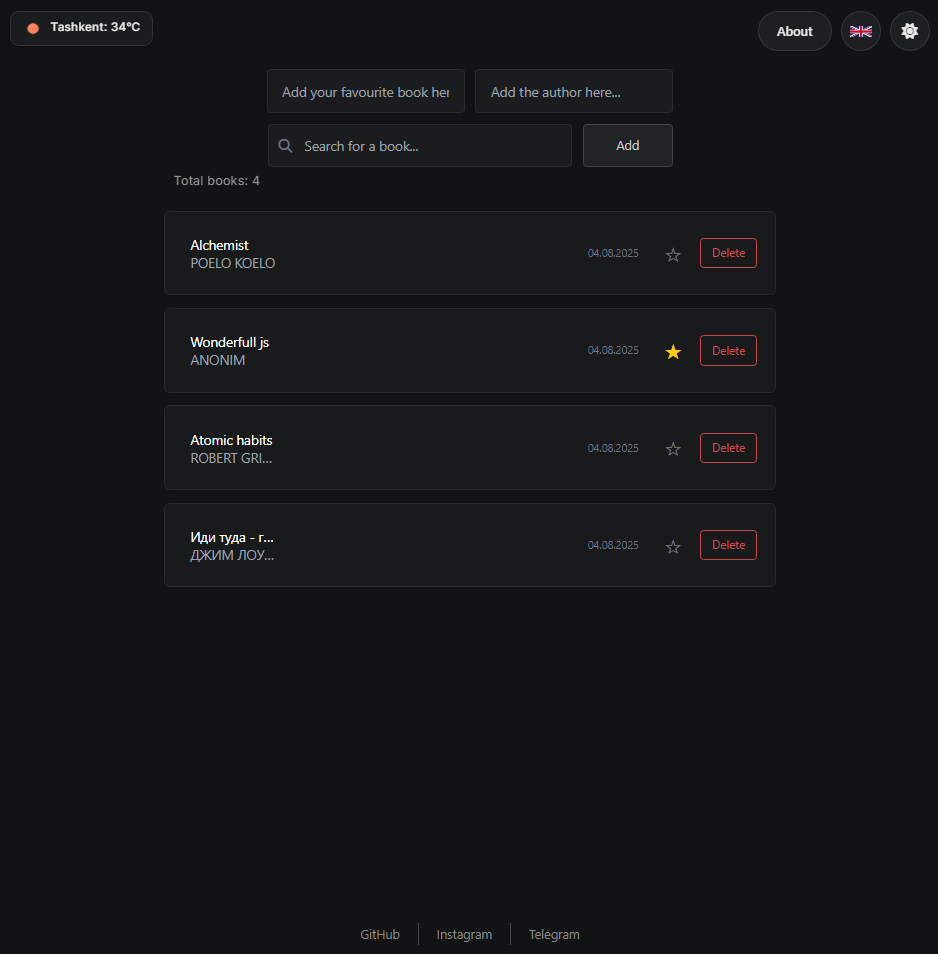

# 📚 Favourite Books Tracker

A clean and lightweight web app for managing your favourite books.  
You can add books, mark your favorites, and view real-time weather—all in one polished interface. The app uses a custom Express.js backend with JSON file storage (db.json).

---

## ⚙️ How to Use

1. **Clone or download** the project:

```bash
git clone https://github.com/foreverstoboiii/FavBook.git

```

2. Install dependencies.
```bash
npm install
```

3. Start the Express server.
```bash
npm start
```
4. Open your browser and go to:
```bash
http://localhost:3000
```

## 📸 Preview

Login page:


Here is a preview of the Book Tracker app in dark mode:




## 💡 Features:
```bash
• 📘 Add and remove books

• ⭐ Mark books as favorites

• 🌍 View current weather information (via external API)

• 🌓 Toggle between light and dark themes

• 💾 Server-side data storage with Express and db.json

• 💡 Responsive design with smooth user experience

• 🧠 Clean code and modular structure
```
## 🧠 Tech Stack
```bash
• Frontend: HTML, CSS, JavaScript

• Backend: Node.js, Express.js

• Database: JSON file (db.json)
```


## 💻Author
Made with minimalism and UX focus by foreverstoboiii.


> 

